# VirtualMachine and VirtualMachineTemplateRequests

## Overview

The VirtualMachineTemplates and VirtualMachineTemplateRequests feature provides a declarative way to create reusable VM templates from existing VirtualMachines. This system captures the complete state of a VM, including its persistent data through snapshots, and packages it into a template that can be used to create identical VMs with unique names and data volumes.

## Architecture

### Components

1. **VirtualMachineTemplate** - A reusable template containing a VM specification with parameterized fields
2. **VirtualMachineTemplateRequest** - A request to create a template from an existing VM
3. **TemplateRequestController** - Controller that orchestrates the template creation process
4. **VirtualMachineSnapshot** - Captures the VM state and persistent data
5. **VirtualMachineSnapshotContent** - Contains the actual snapshot data and volume mappings

### Design Principles

- **Declarative API**: Users express intent through VirtualMachineTemplateRequest resources
- **Snapshot-based**: Templates include snapshot data to ensure consistent VM creation
- **Parameterized**: Templates use parameters to allow customization during VM creation
- **Conflict-free**: DataVolume names are prefixed to avoid naming conflicts
- **Event-driven**: Controller responds to resource changes through informers

## API Specifications

### VirtualMachineTemplateRequest

```yaml
apiVersion: template.kubevirt.io/v1alpha1
kind: VirtualMachineTemplateRequest
metadata:
  name: my-template-request
  namespace: default
spec:
  source:
    name: source-vm
    namespace: default  # Optional, defaults to request namespace
status:
  phase: Pending | InProgress | Succeeded | Failed
  observedGeneration: 1
  snapshot:
    kind: VirtualMachineSnapshot
    name: my-template-request-snapshot
    namespace: default
  template:
    apiGroup: template.kubevirt.io
    kind: VirtualMachineTemplate
    name: my-template-request-template
    namespace: default
  conditions:
  - type: SnapshotReady
    status: "True"
    reason: Ready
    message: "Snapshot is ready"
  - type: TemplateReady
    status: "True"
    reason: Ready
    message: "Template is ready"
  - type: Ready
    status: "True"
    reason: Completed
    message: "Template request completed successfully"
```

### VirtualMachineTemplate

```yaml
apiVersion: template.kubevirt.io/v1alpha1
kind: VirtualMachineTemplate
metadata:
  name: my-template
  namespace: default
spec:
  parameters:
  - name: VM_NAME
    description: "Name of the Virtual Machine"
    from: "vm-my-template-[a-z0-9]{16}"
    generate: expression
  virtualMachine:
    # Raw VirtualMachine specification with parameterized fields
    # DataVolumeTemplates rewritten to use VolumeSnapshots
```

## Controller Logic

### TemplateRequestController

The controller implements a state machine that processes VirtualMachineTemplateRequest resources through the following phases:

#### Phase Transitions

```
Pending → InProgress → Succeeded
                   ↘ Failed
```

#### Core Operations

1. **Status Initialization**
   - Set phase to `Pending`
   - Initialize `observedGeneration`

2. **Source VM Validation**
   - Retrieve source VM from informer cache
   - Validate VM exists and is accessible

3. **Snapshot Management**
   - Create VirtualMachineSnapshot with owner reference
   - Monitor snapshot readiness through conditions and `ReadyToUse` field
   - Update `SnapshotReady` condition based on snapshot state

4. **Template Creation**
   - Wait for snapshot to be ready
   - Create enhanced VM specification with snapshot-backed DataVolumes
   - Generate VirtualMachineTemplate with parameterized fields

5. **DataVolumeTemplate Enhancement**
   - Retrieve VirtualMachineSnapshotContent
   - Map PVC names to VolumeSnapshot names from VolumeBackups
   - Rewrite DataVolumeTemplates to use VolumeSnapshots as sources
   - Prefix DataVolumeTemplate names with `${VM_NAME}` parameter
   - Update Volume references in VM spec to match new names

6. **Status Management**
   - Immediate status updates after setting references
   - Retry logic with exponential backoff for conflicts
   - Comprehensive condition tracking

## Complete Lifecycle Sequence

```mermaid
sequenceDiagram
    participant User
    participant Controller as TemplateRequestController
    participant API as Kubernetes API
    participant VMInformer as VM Informer
    participant SnapshotInformer as Snapshot Informer
    participant TemplateInformer as Template Informer
    participant VMSnapshot as VirtualMachineSnapshot
    participant VMSnapshotContent as VirtualMachineSnapshotContent
    participant VMTemplate as VirtualMachineTemplate

    User->>+API: Create VirtualMachineTemplateRequest
    API->>Controller: Enqueue request (via informer)
    
    Controller->>+API: Get VirtualMachineTemplateRequest
    API-->>-Controller: Return request object
    
    Note over Controller: Initialize status if empty
    Controller->>+API: Update status (Phase: Pending)
    API-->>-Controller: Status updated
    
    Controller->>+API: Update status (Phase: InProgress)
    API-->>-Controller: Status updated
    
    Note over Controller: Get source VirtualMachine
    Controller->>+VMInformer: GetByKey(namespace/name)
    VMInformer-->>-Controller: Return source VM
    
    Note over Controller: Handle Snapshot Creation
    alt Snapshot reference not in status
        Controller->>+API: Create VirtualMachineSnapshot
        Note over API: Snapshot with OwnerReference<br/>pointing to TemplateRequest
        API-->>-Controller: Created snapshot
        
        Note over Controller: Validate snapshot name/namespace
        Controller->>+API: Update status with snapshot reference
        Note over API: Set SnapshotReady condition to False
        API-->>-Controller: Status updated
        
        Controller->>Controller: Record SnapshotCreated event
    else Snapshot reference exists
        Note over Controller: Check snapshot status
    end
    
    Controller->>+SnapshotInformer: GetByKey(snapshot namespace/name)
    SnapshotInformer-->>-Controller: Return snapshot object
    
    Note over Controller: Check snapshot readiness<br/>(ReadyToUse field + conditions)
    
    alt Snapshot not ready
        Controller->>+API: Update SnapshotReady condition to False
        API-->>-Controller: Status updated
        Controller->>Controller: Requeue with delay
    else Snapshot ready
        Controller->>+API: Update SnapshotReady condition to True
        API-->>-Controller: Status updated
        
        Note over Controller: Handle Template Creation
        alt Template reference not in status
            Note over Controller: Get VirtualMachineSnapshotContent
            Controller->>+API: Get VirtualMachineSnapshotContent
            API-->>-Controller: Return content with VolumeBackups
            
            Note over Controller: Copy source VM and enhance
            Controller->>Controller: vm.DeepCopy()
            Controller->>Controller: Clear metadata/status
            Controller->>Controller: Set TypeMeta (APIVersion, Kind)
            
            Note over Controller: Rewrite DataVolumeTemplates
            Controller->>Controller: Map PVC names to VolumeSnapshot names<br/>from VolumeBackups
            
            loop For each DataVolumeTemplate
                Controller->>Controller: Prefix name with ${VM_NAME}
                Controller->>Controller: Set source to VolumeSnapshot
                Controller->>Controller: Clear conflicting sources
            end
            
            Note over Controller: Update Volume references
            Controller->>Controller: Update vmCopy.Spec.Template.Spec.Volumes<br/>to match new DataVolumeTemplate names
            
            Controller->>Controller: Encode VM to RawExtension
            Controller->>Controller: Add default VM_NAME parameter
            
            Controller->>+API: Create VirtualMachineTemplate
            Note over API: Template with OwnerReference<br/>and rewritten DataVolumeTemplates
            API-->>-Controller: Created template
            
            Note over Controller: Validate template name/namespace
            Controller->>+API: Update status with template reference
            Note over API: Set TemplateReady condition to True
            API-->>-Controller: Status updated
            
            Controller->>Controller: Record TemplateCreated event
        else Template reference exists
            Note over Controller: Check template status
        end
        
        Controller->>+TemplateInformer: GetByKey(template namespace/name)
        TemplateInformer-->>-Controller: Return template object
        
        alt Template not found in informer
            Controller->>+API: Update TemplateReady condition to False
            API-->>-Controller: Status updated
            Controller->>Controller: Requeue with delay
        else Template found
            Controller->>+API: Update TemplateReady condition to True
            API-->>-Controller: Status updated
            
            Note over Controller: Check if both snapshot and template ready
            alt Both ready
                Controller->>+API: Update status (Phase: Succeeded)
                Note over API: Set Ready condition to True
                API-->>-Controller: Status updated
                Controller->>Controller: Record Synced event
                Note over Controller: Template Request Complete!
            else Not both ready
                Controller->>Controller: Continue monitoring
            end
        end
    end
    
    Note over Controller,VMTemplate: Event-driven reprocessing
    VMSnapshot->>Controller: Snapshot status changed (via informer)
    VMTemplate->>Controller: Template status changed (via informer)
    Controller->>Controller: Enqueue request for reprocessing
    
    Note over User: Template ready for use
    User->>+API: Create VM from template
    Note over API: VM created with snapshot-backed<br/>DataVolumes using unique names
    API-->>-User: VM with ${VM_NAME}-disk1, ${VM_NAME}-disk2, etc.
```



## Implementation Details

### DataVolumeTemplate Enhancement

The controller implements sophisticated logic to rewrite DataVolumeTemplates for snapshot-backed storage:

1. **VolumeSnapshot Mapping**
   ```go
   // Get VirtualMachineSnapshotContent
   content, err := clientset.VirtualMachineSnapshotContent(namespace).Get(ctx, contentName, metav1.GetOptions{})
   
   // Create mapping from PVC names to VolumeSnapshot names
   pvcToVolumeSnapshot := make(map[string]string)
   for _, volumeBackup := range content.Spec.VolumeBackups {
       if volumeBackup.VolumeSnapshotName != nil {
           pvcToVolumeSnapshot[volumeBackup.PersistentVolumeClaim.Name] = *volumeBackup.VolumeSnapshotName
       }
   }
   ```

2. **DataVolumeTemplate Rewriting**
   ```go
   // Rewrite each DataVolumeTemplate
   for i, dvt := range vmCopy.Spec.DataVolumeTemplates {
       if volumeSnapshotName, exists := pvcToVolumeSnapshot[dvt.Name]; exists {
           newDVT := dvt.DeepCopy()
           
           // Prefix name to avoid conflicts
           originalName := newDVT.Name
           newDVT.Name = fmt.Sprintf("${VM_NAME}-%s", originalName)
           
           // Set VolumeSnapshot as source
           newDVT.Spec.Source = &cdiv1.DataVolumeSource{
               Snapshot: &cdiv1.DataVolumeSourceSnapshot{
                   Namespace: snapshotNamespace,
                   Name:      volumeSnapshotName,
               },
           }
           
           // Clear conflicting sources
           newDVT.Spec.SourceRef = nil
           
           vmCopy.Spec.DataVolumeTemplates[i] = *newDVT
       }
   }
   ```

3. **Volume Reference Updates**
   ```go
   // Update volume references to match new DataVolumeTemplate names
   for i, volume := range vmCopy.Spec.Template.Spec.Volumes {
       if volume.DataVolume != nil {
           if newName, exists := dvtNameMapping[volume.DataVolume.Name]; exists {
               vmCopy.Spec.Template.Spec.Volumes[i].DataVolume.Name = newName
           }
       }
   }
   ```

### TypeMeta Restoration

Objects from informer caches lose TypeMeta during deserialization. The controller restores this for proper template processing:

```go
// Ensure the VM object has proper type metadata for template processing
vmCopy.TypeMeta = metav1.TypeMeta{
    APIVersion: virtv1.SchemeGroupVersion.String(), // "kubevirt.io/v1"
    Kind:       "VirtualMachine",
}
```

### Status Management

The controller implements robust status management to handle race conditions:

1. **Immediate Updates**: Status is updated immediately after setting references to ensure informer cache consistency
2. **Retry Logic**: Exponential backoff handles status update conflicts
3. **Condition Tracking**: Separate conditions track different aspects of readiness

```go
// Update status with retry logic
return wait.ExponentialBackoffWithContext(ctx, wait.Backoff{
    Steps:    5,
    Duration: 100 * time.Millisecond,
    Factor:   2.0,
    Jitter:   0.1,
}, func(ctx context.Context) (bool, error) {
    // Get latest version and update status
    latest, err := client.Get(ctx, templateRequest.Name, metav1.GetOptions{})
    if err != nil {
        return false, err
    }
    
    latest.Status = templateRequest.Status
    latest.Status.ObservedGeneration = latest.Generation
    
    _, err = client.UpdateStatus(ctx, latest, metav1.UpdateOptions{})
    if errors.IsConflict(err) {
        return false, nil // Retry
    }
    return err == nil, err
})
```

## Usage Examples

### Creating a Template from an Existing VM

```yaml
apiVersion: template.kubevirt.io/v1alpha1
kind: VirtualMachineTemplateRequest
metadata:
  name: create-ubuntu-template
  namespace: default
spec:
  source:
    name: ubuntu-vm-original
    namespace: default
```

### Using the Created Template

```bash
# Process the template to create a new VM
virtctl process my-template-request-template | kubectl apply -f -

# Or create directly with custom parameters
virtctl process my-template-request-template --param VM_NAME=my-custom-vm | kubectl apply -f -
```

### Generated Template Structure

The resulting template contains:

```yaml
apiVersion: template.kubevirt.io/v1alpha1
kind: VirtualMachineTemplate
metadata:
  name: my-template-request-template
spec:
  parameters:
  - name: VM_NAME
    description: "Name of the Virtual Machine"
    from: "vm-my-template-request-template-[a-z0-9]{16}"
    generate: expression
  virtualMachine:
    apiVersion: kubevirt.io/v1
    kind: VirtualMachine
    metadata:
      name: ${VM_NAME}
    spec:
      dataVolumeTemplates:
      - metadata:
          name: ${VM_NAME}-disk1  # Prefixed name
        spec:
          source:
            snapshot:
              namespace: default
              name: vmsnapshot-abc123-volume-disk1  # VolumeSnapshot reference
      template:
        spec:
          volumes:
          - name: disk1
            dataVolume:
              name: ${VM_NAME}-disk1  # Updated reference
```

## Error Handling

The controller implements comprehensive error handling:

1. **Source VM Not Found**: Sets phase to `Failed` with appropriate error message
2. **Snapshot Creation Failures**: Retries with exponential backoff
3. **Template Creation Failures**: Handles conflicts and validation errors
4. **Status Update Conflicts**: Automatic retry with conflict resolution

## Events and Observability

The controller emits events for key lifecycle stages:

- `SnapshotCreated`: VirtualMachineSnapshot successfully created
- `TemplateCreated`: VirtualMachineTemplate successfully created
- `Synced`: Template request completed successfully
- `FailedSync`: Error occurred during processing

## Future Enhancements

Potential future improvements include:

1. **Template Versioning**: Support for template versions and updates
2. **Cross-Namespace Templates**: Templates that can be used across namespaces
3. **Template Sharing**: Registry or catalog of shared templates
4. **Advanced Parameterization**: More sophisticated parameter handling
5. **Template Validation**: Validation webhooks for template correctness
6. **Cleanup Policies**: Configurable cleanup of snapshots and intermediate resources

## Development and Testing

For development and testing of this feature:

1. **Unit Tests**: Test controller logic in isolation
2. **Integration Tests**: Test complete workflows with real Kubernetes resources
3. **E2E Tests**: Test user workflows end-to-end
4. **Performance Tests**: Validate behavior with large numbers of templates

## References

- [KubeVirt VirtualMachine API](https://kubevirt.io/api-reference/v1.3.1/definitions.html#_v1_virtualmachine)
- [VirtualMachineSnapshot Documentation](https://kubevirt.io/user-guide/storage/snapshots/)
- [OpenShift Templates](https://docs.openshift.com/container-platform/4.14/openshift_images/using-templates.html) 