# VEP \#NNNN: Native Support For VirtualMachine Templates 

## Release Signoff Checklist

Items marked with (R) are required *prior to targeting a milestone / release*.

- [ ] (R) Enhancement issue created, which links to VEP dir in \[kubevirt/enhancements\] (not the initial VEP PR)  
- [ ] (R) Target version is explicitly mentioned and approved  
- [ ] (R) Graduation criteria filled

## Overview

Virtual Machine (VM) templates are traditionally pre-configured VMs that serve as blueprints for creating new VMs. They encapsulate the operating system, installed software, and configuration settings, allowing for the rapid and consistent deployment of VMs. Using templates streamlines the VM creation process, reduces errors, and ensures uniformity across the virtualized environment.

While KubeVirt provides many of the building blocks associated with VM templates such as snapshots, import/export, and cloning there are no native easy-to-use template workflows available to end-users within the project at present.

This enhancement aims to provide such workflows, reusing and extending existing functionality where possible to provide native in-cluster templating of VirtualMachines with snapshot-backed storage and conflict-free naming.

## Motivation {#motivation}

The concept of templating in-cluster workloads is generally discouraged by Kubernetes, which instead focuses on external workload template tooling such as Helm and Kustomize. This approach presents a challenge when templating VMs as their associated storage state needs to be captured, stored and somehow referenced by the external definitions when using these tools.

While users can achieve this today by scripting numerous native KubeVirt API calls (snapshot & export etc) or through the use of external tooling such as disk-uploader from kubevirt-tekton-tasks the resulting state still needs to be hosted somewhere and referenced by the externally templated definition of the VM.

As the term suggests, external templating of VMs also does not provide any in-cluster representation of these templated workloads that users of more traditional Virtualization platforms might also expect.

Downstream vendors have until now provided limited support for in-cluster VirtualMachine templating with KubeVirt.

For example, OKD and OpenShift provide their own in-cluster `Template` CRD, a generic object templating resource that allows users to parameterise any object definition before rendering and creating it in the cluster. This CRD is currently used to provide golden image based VirtualMachine templates to end users through the common-templates project. There is currently no support in OKD or OpenShift for existing VirtualMachines to be turned into reusable templates with the same level of parametrisation and customisation as the golden image templates.

Instance types and preferences were introduced to simplify the initial creation of VMs but importantly do not provide references to additional networks and volumes that should be attached to a VM. This design decision was taken to ensure instance types and preferences were generic and reusable across differing clusters by not retaining cluster specific data. As such they cannot be used as a substitute for a more complete and traditional VM template mechanism.

Providing a native in-cluster workflow for both the creation of VM templates and VMs from said templates will reduce the burden on end users to cobble together their own implementations with a more seamless and traditional Virtualization platform experience within the project.

## Use cases

This enhancement focuses on two core use cases for VM templates. 

The first being a golden image based template where the underlying golden image is periodically updated. This is the use case currently targeted downstream within OKD and OpenShift with their use of the `Template` CRD and common-templates project.

The second use case being the more traditional existing VM based template, which captures the complete state of a VM including its persistent data through snapshots and packages it into a template that can be used to create identical VMs with unique names and data volumes.

Both use cases should eventually enable the customisation and creation of new VMs in separate namespaces to that of the template.

The existing VM use case should also eventually allow for some level of automated prepping and sealing of the original VM. For example, running specific commands within the guest or against the snapshotted disks.

### Golden Image templates

```
graph LR
    subgraph ImageNamespace ["Image Namespace"]
        B("Golden Image Source")
    end
    subgraph TemplateNamespace ["Template Namespace"]
        C{"VM Template"}
    end

    B -- "Derived From" --> C
    C -- "Customize & Create VMs" --> E("VM Deployment Process")

    subgraph VMNamespaceA ["VM Namespace A"]
        F("Deployed Virtual Machine 1")
    end
    subgraph VMNamespaceB ["VM Namespace B"]
        G("Deployed Virtual Machine 2")
    end
    subgraph VMNamespaceC ["VM Namespace C"]
        H("Deployed Virtual Machine 3")
    end

    E --> F
    E --> G
    E --> H


```

### Existing VirtualMachine templates

```
graph LR
   subgraph VMNamespaceA ["VM Namespace A (Source)"]
       A("Source Virtual Machine")
   end
   A -- "Snapshot / Prepare / Seal" --> B("Sealed VM Snapshot")

   subgraph TemplateNamespace ["Template Namespace"]
       C{"VM Template"}
   end
   B --> C

   C -- "Customize / Create VMs" --> F("VM Deployment Process")

   subgraph VMNamespaceB ["VM Namespace B"]
       H("Deployed Virtual Machine 1")
   end
   subgraph VMNamespaceC ["VM Namespace C"]
       I("Deployed Virtual Machine 2")
   end
   subgraph VMNamespaceD ["VM Namespace D"]
       G("Deployed Virtual Machine 3")
   end

   F --> H
   F --> I
   F --> G

```

## Export / Import of VirtualMachine templates between clusters

```
graph LR
   subgraph ClusterA [Cluster A]
       subgraph VMNamespaceA [VM Namespace A]
           A("VirtualMachine Source")
       end
       A -- "Snapshot / Prepare / Seal" --> B("Sealed VM Snapshot")
       subgraph TemplateNamespaceA [Template Namespace]
           C{"VM Template (Cluster A)"}
       end
       B --> C
   end

   C -- "Export" --> F("Exported VM Template")
   F -- "Push to" --> R(["Image Registry"])
   R -- "Pull from" --> I("Imported VM Template")

   subgraph ClusterB [Cluster B]
       subgraph TemplateNamespaceB [Template Namespace]
           G{"VM Template (Cluster B)"}
       end
       I --> G
       G -- "Customize / Create" --> H("Deployment Process")

       subgraph VMNamespaceB [VM Namespace B]
           J("Deployed VirtualMachine 1")
       end
       subgraph VMNamespaceC [VM Namespace C]
           K("Deployed VirtualMachine 2")
       end
       subgraph VMNamespaceD [VM Namespace D]
           L("Deployed VirtualMachine 3")
       end

       H --> J
       H --> K
       H --> L
   end


```

## Goals

### Primary Goals (v1alpha1)

- **Enable declarative VM template creation**: Provide a native `VirtualMachineTemplateRequest` API that allows users to create templates from existing VirtualMachines with a single resource definition
- **Implement snapshot-backed storage**: Automatically capture VM state through VirtualMachineSnapshots and rewrite DataVolumeTemplates to use VolumeSnapshots as sources
- **Ensure conflict-free VM deployment**: Provide parameterized naming with `${VM_NAME}` prefixing to allow multiple VM instances from the same template without naming conflicts
- **Support golden image templates**: Enable creation of templates from container disk images with parameterized configuration for easy VM provisioning
- **Provide seamless template processing**: Implement `virtctl process` command for easy template parameter substitution and VM creation

### Secondary Goals (v1beta1+)

- **Enable cross-namespace template sharing**: Allow templates to be created and used across different namespaces within the same cluster
- **Support inter-cluster template distribution**: Enable export/import of templates between clusters for centralized template management
- **Integrate with external formats**: Support import of OVA/OVF appliances as native VirtualMachineTemplates
- **Provide template versioning**: Support template updates and version management for lifecycle management
- **Enable template validation**: Implement webhook validation for template correctness and security compliance

### Success Criteria

- **Developer Experience**: Developers can create VMs from templates with minimal configuration (name and instance type only)
- **Administrative Control**: Cluster administrators can provide standardized, secure templates that enforce policies and best practices
- **Operational Efficiency**: DevOps teams can create templates from production VMs for consistent development and testing environments
- **Storage Efficiency**: Templates use snapshot-backed storage to minimize storage overhead while maintaining data consistency
- **Scalability**: The system supports hundreds of templates and thousands of VM instances without performance degradation

## Non Goals

- 

## Definition of users

### VM Owner
A user who has ownership of VirtualMachine resources within a namespace. This user is responsible for creating, managing, and maintaining VMs and has the necessary permissions to create templates from their VMs.

### Cluster Administrator
A user with elevated privileges who manages the overall Kubernetes cluster infrastructure. They are responsible for cluster-wide policies, resource quotas, security configurations, and providing standardized resources to other users.

### DevOps Engineer
A technical user who bridges development and operations, responsible for automating deployment processes, maintaining CI/CD pipelines, and ensuring smooth transitions between development, testing, and production environments.

### Platform Operator
A user responsible for managing and maintaining the platform layer of the Kubernetes cluster, including service catalogs, shared resources, and platform-level configurations that serve multiple teams and applications.

### Developer
An application developer who needs to create and test VMs for development purposes. They typically have limited infrastructure knowledge and prefer simple, self-service approaches to resource provisioning.

### Security Administrator
A specialized user focused on implementing and maintaining security policies, compliance requirements, and access controls across the cluster. They ensure that all resources meet security standards and regulatory requirements.

### Backup Administrator
A user responsible for data protection, disaster recovery planning, and maintaining backup strategies. They ensure business continuity through proper backup and restoration procedures.

### Network Administrator
A user responsible for managing network infrastructure, including network policies, firewall configurations, load balancers, and network security within the Kubernetes cluster.

### Storage Administrator
A user responsible for managing storage infrastructure, including storage classes, volume configurations, and storage optimization strategies to meet different workload requirements.

### Performance Engineer
A specialized user focused on optimizing application and infrastructure performance. They analyze performance characteristics and tune configurations for optimal resource utilization and application responsiveness.

### Compliance Officer
A user responsible for ensuring that all systems and processes meet regulatory requirements, industry standards, and internal policies. They oversee audit processes and compliance reporting.

### Cost Optimization Specialist
A user focused on managing infrastructure costs, resource utilization, and budget optimization. They analyze usage patterns and implement strategies to reduce unnecessary spending while maintaining performance.

## User Stories

- As a VM owner I want the ability to create a templated VirtualMachines referencing a golden image  
- As a VM owner I want the ability to create a templated VirtualMachines from an existing VirtualMachine with snapshot-backed storage
- As a VM owner I want the ability to create a VirtualMachine from a templated VirtualMachine that is stored in a different namespace
- As a VM owner I want the ability to create multiple VMs from the same template without naming conflicts
- As a cluster administrator I want to provide standardized VM templates to developers that include pre-configured security policies, resource limits, and network configurations
- As a DevOps engineer I want to create VM templates from production-ready VMs that can be used to quickly provision development and testing environments
- As a platform operator I want to maintain a catalog of VM templates that can be shared across multiple namespaces and teams within the cluster
- As a developer I want to create VMs from templates with minimal configuration, only needing to specify a name and instance type
- As a security administrator I want to ensure that VM templates enforce security best practices and compliance requirements across all VM deployments
- As a backup administrator I want to create VM templates from snapshots to ensure disaster recovery capabilities and point-in-time VM restoration
- As a network administrator I want to create VM templates that include pre-configured network policies, firewall rules, and load balancer configurations
- As a storage administrator I want to create VM templates that use specific storage classes and volume configurations optimized for different workloads
- As a performance engineer I want to create VM templates with pre-tuned performance parameters for specific application workloads
- As a compliance officer I want to ensure that all VMs created from templates meet regulatory requirements and audit standards
- As a cost optimization specialist I want to create VM templates with appropriate resource sizing to prevent over-provisioning and reduce infrastructure costs

## Repos

- kubevirt/kubevirt  
- kubevirt/common-templates

## Design

### template.kubevirt.io/v1alpha1

#### VirtualMachineTemplate

A new `template.kubevirt.io` APIGroup will be introduced with an initial `v1alpha1` version being provided. The APIGroup will provide a single `VirtualMachineTemplate` CRD heavily influenced by the `template.openshift.io` APIGroup and `Template` CRD provided downstream within OKD and OpenShift.

Deployment of the APIGroup and CRDs will sit behind the `Template` FeatureGate.

This initial version will focus on satisfying the simple golden image based VM template use case discussed above.

```
apiVersion: template.kubevirt.io/v1alpha1
kind: VirtualMachineTemplate
metadata:
  name: fedora
spec:
  parameters:
  - name: VM_NAME
    description: "Name of the Virtual Machine"
    from: "vm-fedora-[a-z0-9]{16}"
    generate: expression
  - name: INSTANCE_TYPE
    value: "u1.large"
  - name: FEDORA_VERSION
    value: "latest"
  virtualMachine:
    apiVersion: kubevirt.io/v1
    kind: VirtualMachine
    metadata:
      name: ${VM_NAME}
    spec:
      runStrategy: Always
      instancetype:
        name: ${INSTANCE_TYPE}
      preference:
        name: fedora
      dataVolumeTemplates:
        - metadata:
            name: ${VM_NAME}-fedora
          spec:
            source:
              registry:
                url: docker://quay.io/containerdisks/fedora:${FEDORA_VERSION}
            storage:
              resources:
                requests:
                  storage: 10Gi
      template:
        spec:
          domain:
            devices: {}
            resources: {}
          volumes:
            - dataVolume:
                name: ${VM_NAME}-fedora
              name: fedora
          terminationGracePeriodSeconds: 180
```

Initially this will handle cross namespace template to VM creation using the same CDI workaround as the common-templates project currently employs. Providing a namespaced `SourceRef` reference to a `DataSource` golden image within the DataVolumeTemplate section of the VirtualMachine. This is currently the only way a VirtualMachine can be created using storage from another namespace until [KEP-3294](https://github.com/kubernetes/enhancements/tree/master/keps/sig-storage/3294-provision-volumes-from-cross-namespace-snapshots) and [KEP-3766](https://github.com/robscott/k8s-enhancements/tree/master/keps/sig-auth/3766-referencegrant) are addressed within core Kubernetes and later KubeVirt's own CDI project.

This design will hopefully allow users of the current downstream OpenShift based template implementation to try out this new implementation and in doing so provide quick and valuable feedback we can use to justify graduation. To help with this a fork of the common-templates project will be created replacing the existing Template definitions with new VirtualMachineTemplates.

As with the downstream implementation of the `Template` CRD the associated logic to process the template will be provided by a client and subresource detailed below.

#### virtctl process ${VirtualMachineTemplateName}

A new process command will be introduced to the `virtctl` binary, again very much influenced by the `oc process` command provided downstream by OKD and OpenShift.

This command will process an optionally namespaced reference to a VirtualMachineTemplate object or raw local VirtualMachineTemplate definition, applying any supplied parameters before outputting a fully rendered VirtualMachine to stdout.

```
$ virtctl process fedora -p INSTANCE_TYPE=u1.medium -p VM_NAME=my-custom-vm
```

#### VirtualMachineTemplateRequest

A `VirtualMachineTemplateRequest` CRD will be introduced. This CRD will allow for an existing VirtualMachine to be captured as a template.

This process will be orchestrated by a new controller that will process VirtualMachineTemplateRequests, capture a VirtualMachineSnapshot of the target VirtualMachine and create the eventual VirtualMachineTemplate object that contains a representation of the original VirtualMachine object.

Any DataVolumeTemplates present in the original VirtualMachine will be rewritten to use VolumeSnapshots captured by the VirtualMachineSnapshot of the original VirtualMachine. The controller will prefix DataVolumeTemplate names with `${VM_NAME}` parameter to ensure conflict-free naming when multiple VMs are created from the same template.

This will initially only be supported within the same namespace as the original target VirtualMachine while we wait for cross namespace support for volume populators to land upstream in core Kubernetes.

The resulting VirtualMachineTemplate will still need to be processed to generate a VirtualMachine definition.

The controller implements a state machine that processes VirtualMachineTemplateRequest resources through the following phases:

```
Pending → InProgress → Succeeded
                   ↘ Failed
```

The controller performs the following core operations:

1. **Status Initialization**: Set phase to `Pending` and initialize `observedGeneration`
2. **Source VM Validation**: Retrieve source VM from informer cache and validate it exists
3. **Snapshot Management**: Create VirtualMachineSnapshot with owner reference and monitor readiness
4. **Template Creation**: Wait for snapshot to be ready, then create enhanced VM specification with snapshot-backed DataVolumes
5. **DataVolumeTemplate Enhancement**: Retrieve VirtualMachineSnapshotContent, map PVC names to VolumeSnapshot names from VolumeBackups, rewrite DataVolumeTemplates to use VolumeSnapshots as sources, prefix names with `${VM_NAME}` parameter, and update Volume references in VM spec
6. **Status Management**: Immediate status updates after setting references, retry logic with exponential backoff for conflicts, comprehensive condition tracking

### Complete Lifecycle Sequence

```mermaid
sequenceDiagram
    participant User
    participant Controller as TemplateRequestController
    participant API as Kubernetes API
    participant VMInformer as VM Informer
    participant SnapshotInformer as Snapshot Informer
    participant TemplateInformer as Template Informer
    participant VMSnapshot as VirtualMachineSnapshot
    participant VMSnapshotContent as VirtualMachineSnapshotContent
    participant VMTemplate as VirtualMachineTemplate

    User->>+API: Create VirtualMachineTemplateRequest
    API->>Controller: Enqueue request (via informer)
    
    Controller->>+API: Get VirtualMachineTemplateRequest
    API-->>-Controller: Return request object
    
    Note over Controller: Initialize status if empty
    Controller->>+API: Update status (Phase: Pending)
    API-->>-Controller: Status updated
    
    Controller->>+API: Update status (Phase: InProgress)
    API-->>-Controller: Status updated
    
    Note over Controller: Get source VirtualMachine
    Controller->>+VMInformer: GetByKey(namespace/name)
    VMInformer-->>-Controller: Return source VM
    
    Note over Controller: Handle Snapshot Creation
    alt Snapshot reference not in status
        Controller->>+API: Create VirtualMachineSnapshot
        Note over API: Snapshot with OwnerReference<br/>pointing to TemplateRequest
        API-->>-Controller: Created snapshot
        
        Note over Controller: Validate snapshot name/namespace
        Controller->>+API: Update status with snapshot reference
        Note over API: Set SnapshotReady condition to False
        API-->>-Controller: Status updated
        
        Controller->>Controller: Record SnapshotCreated event
    else Snapshot reference exists
        Note over Controller: Check snapshot status
    end
    
    Controller->>+SnapshotInformer: GetByKey(snapshot namespace/name)
    SnapshotInformer-->>-Controller: Return snapshot object
    
    Note over Controller: Check snapshot readiness<br/>(ReadyToUse field + conditions)
    
    alt Snapshot not ready
        Controller->>+API: Update SnapshotReady condition to False
        API-->>-Controller: Status updated
        Controller->>Controller: Requeue with delay
    else Snapshot ready
        Controller->>+API: Update SnapshotReady condition to True
        API-->>-Controller: Status updated
        
        Note over Controller: Handle Template Creation
        alt Template reference not in status
            Note over Controller: Get VirtualMachineSnapshotContent
            Controller->>+API: Get VirtualMachineSnapshotContent
            API-->>-Controller: Return content with VolumeBackups
            
            Note over Controller: Copy source VM and enhance
            Controller->>Controller: vm.DeepCopy()
            Controller->>Controller: Clear metadata/status
            Controller->>Controller: Set TypeMeta (APIVersion, Kind)
            
            Note over Controller: Rewrite DataVolumeTemplates
            Controller->>Controller: Map PVC names to VolumeSnapshot names<br/>from VolumeBackups
            
            loop For each DataVolumeTemplate
                Controller->>Controller: Prefix name with ${VM_NAME}
                Controller->>Controller: Set source to VolumeSnapshot
                Controller->>Controller: Clear conflicting sources
            end
            
            Note over Controller: Update Volume references
            Controller->>Controller: Update vmCopy.Spec.Template.Spec.Volumes<br/>to match new DataVolumeTemplate names
            
            Controller->>Controller: Encode VM to RawExtension
            Controller->>Controller: Add default VM_NAME parameter
            
            Controller->>+API: Create VirtualMachineTemplate
            Note over API: Template with OwnerReference<br/>and rewritten DataVolumeTemplates
            API-->>-Controller: Created template
            
            Note over Controller: Validate template name/namespace
            Controller->>+API: Update status with template reference
            Note over API: Set TemplateReady condition to True
            API-->>-Controller: Status updated
            
            Controller->>Controller: Record TemplateCreated event
        else Template reference exists
            Note over Controller: Check template status
        end
        
        Controller->>+TemplateInformer: GetByKey(template namespace/name)
        TemplateInformer-->>-Controller: Return template object
        
        alt Template not found in informer
            Controller->>+API: Update TemplateReady condition to False
            API-->>-Controller: Status updated
            Controller->>Controller: Requeue with delay
        else Template found
            Controller->>+API: Update TemplateReady condition to True
            API-->>-Controller: Status updated
            
            Note over Controller: Check if both snapshot and template ready
            alt Both ready
                Controller->>+API: Update status (Phase: Succeeded)
                Note over API: Set Ready condition to True
                API-->>-Controller: Status updated
                Controller->>Controller: Record Synced event
                Note over Controller: Template Request Complete!
            else Not both ready
                Controller->>Controller: Continue monitoring
            end
        end
    end
    
    Note over Controller,VMTemplate: Event-driven reprocessing
    VMSnapshot->>Controller: Snapshot status changed (via informer)
    VMTemplate->>Controller: Template status changed (via informer)
    Controller->>Controller: Enqueue request for reprocessing
    
    Note over User: Template ready for use
    User->>+API: Create VM from template
    Note over API: VM created with snapshot-backed<br/>DataVolumes using unique names
    API-->>-User: VM with ${VM_NAME}-disk1, ${VM_NAME}-disk2, etc.
```



#### virtctl create template

A new `create template` command will be introduced to the `virtctl` binary. This will allow users to generate an appropriate `